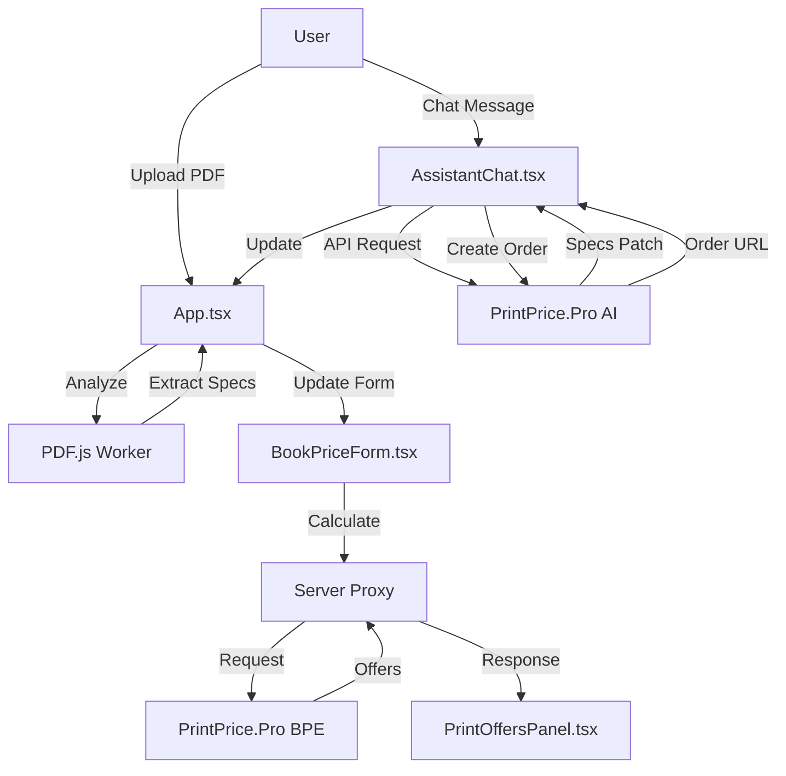

# 📚 PrintPrice Pro - Book Price Calculator

> **Powered by [PrintPrice.Pro](https://printprice.pro)** | **Designed by [LatinFlash LDA](https://latinflash.com)**

A modern, intelligent web application for calculating book printing costs with AI-powered assistance. This application integrates with the PrintPrice.Pro pricing engine to provide real-time quotes from multiple print houses.

---

## 🌟 Features

### Core Functionality
- **📄 PDF Analysis**: Automatic detection of book specifications from uploaded PDF files
  - Page count extraction
  - Size and orientation detection (A3-A6, B4-B6, Custom)
  - Color vs. Black & White detection
  
- **💰 Real-Time Pricing**: Integration with PrintPrice.Pro Book Price Engine (BPE)
  - Multiple print house quotes
  - Detailed cost breakdowns (printing, paper, binding, finishing, delivery)
  - Support for 25+ delivery countries
  
- **🤖 AI Assistant**: Intelligent chat interface powered by PrintPrice.Pro AI
  - Natural language project description
  - Automatic specification normalization
  - Real-time quote calculation
  - Order creation assistance

- **📊 Comprehensive Specifications**:
  - Book sizes: A3, A4, A5, A6, B4, B5, B6, Custom
  - Interior print modes: 4/4 (Full Color), 1/1 (B&W), and aliases
  - Cover print modes: 4/0, 4/4, 1/0, and descriptive aliases
  - Binding methods: Perfect Bound, Hardcover, Saddle Stitch, Wire-O, Spiral
  - Finishing options: Gloss/Matt lamination, Soft Touch, UV Spot, Foil
  - Paper weights: Customizable GSM for interior, cover, and endpapers
  - Endpapers support with print options

---

## 🏗️ Architecture

### Frontend (React + TypeScript + Vite)

```
├── App.tsx                    # Main application component
├── index.tsx                  # Application entry point
├── index.css                  # Global styles
├── types.ts                   # TypeScript type definitions
├── constants.ts               # Application constants and API endpoints
├── components/                # React components
│   ├── AssistantChat.tsx      # AI chat interface
│   ├── BookPriceForm.tsx      # Specification form
│   ├── PrintOffersPanel.tsx   # Quotes display panel
│   ├── PdfUploadDropzone.tsx  # PDF upload component
│   ├── PreflightDropzone.tsx  # PDF preflight component
│   ├── PreflightSummary.tsx   # PDF analysis summary
│   ├── PageViewer.tsx         # PDF page viewer
│   ├── IssuesPanel.tsx        # PDF issues display
│   ├── FixDrawer.tsx          # PDF correction drawer
│   ├── AIAuditModal.tsx       # AI audit modal
│   ├── EfficiencyAuditModal.tsx # Efficiency audit modal
│   ├── SafeHtmlMarkdown.tsx   # Safe HTML renderer
│   └── Header.tsx             # Application header
├── i18n/                      # Internationalization
│   └── en.ts                  # English translations
├── workers/                   # Web Workers
│   └── preflight.worker.ts    # PDF processing worker
└── loader/                    # Loading utilities
```

### Backend (Node.js + Express)

```
server/
├── server.js                  # Express server with proxy functionality
├── package.json               # Server dependencies
└── public/                    # Public assets
    ├── service-worker.js      # Service worker for offline support
    └── websocket-interceptor.js # WebSocket proxy interceptor
```

### Key Technologies

**Frontend:**
- **React 19.2.0**: Modern UI library with hooks
- **TypeScript 5.8.2**: Type-safe development
- **Vite 6.2.0**: Fast build tool and dev server
- **PDF.js 5.4.394**: PDF rendering and analysis
- **Heroicons 2.2.0**: Beautiful icon set

**Backend:**
- **Express 4.18.2**: Web server framework
- **Axios 1.6.7**: HTTP client for API calls
- **WebSocket (ws 8.17.0)**: Real-time communication
- **Express Rate Limit 7.5.0**: API rate limiting
- **dotenv 16.4.5**: Environment variable management

---

## 🔌 API Integration

### PrintPrice.Pro Endpoints

1. **Book Price Engine (BPE)**
   - **Endpoint**: `https://printprice.pro/wp-json/bpe/v1/estimates`
   - **Method**: POST
   - **Purpose**: Calculate printing costs and get quotes from multiple print houses
   - **Payload**: Book specifications (size, pages, binding, finishing, etc.)

2. **AI Assistant**
   - **Endpoint**: `https://printprice.pro/wp-json/printprice-ai/v1/chat`
   - **Method**: POST
   - **Purpose**: Natural language processing for project specifications
   - **Features**: Spec normalization, quote calculation, order creation

3. **Order Creation**
   - **Endpoint**: `https://printprice.pro/wp-content/plugins/print-price-pro-corrected/includes/api/create-order-from-chat-endpoint.php`
   - **Method**: POST
   - **Purpose**: Create print orders directly from chat interface

---

## 📦 Installation

### Prerequisites

- **Node.js**: v22 or higher
- **npm**: v9 or higher
- **Google Cloud SDK** (optional, for deployment)

### Local Development

1. **Clone the repository**
   ```bash
   git clone https://github.com/drleuman/PrintPricePro_BookPrice.git
   cd PrintPricePro_BookPrice
   ```

2. **Install frontend dependencies**
   ```bash
   npm install
   ```

3. **Install server dependencies**
   ```bash
   cd server
   npm install
   cd ..
   ```

4. **Configure environment variables**
   
   Create a `.env.local` file in the root directory:
   ```env
   GEMINI_API_KEY=your_gemini_api_key_here
   ```

5. **Start development servers**

   **Option A: Run both frontend and backend separately**
   
   Terminal 1 (Frontend):
   ```bash
   npm run dev
   ```
   
   Terminal 2 (Backend):
   ```bash
   cd server
   npm run dev
   ```

   **Option B: Production build**
   ```bash
   npm run build
   cd server
   npm start
   ```

6. **Access the application**
   - Frontend dev server: `http://localhost:3000`
   - Backend server: `http://localhost:3000` (when running production build)

---

## 🐳 Docker Deployment

### Build and Run with Docker

```bash
# Build the Docker image
docker build -t printprice-calculator .

# Run the container
docker run -p 3000:3000 \
  -e GEMINI_API_KEY=your_api_key_here \
  printprice-calculator
```

### Docker Compose (Optional)

Create a `docker-compose.yml`:

```yaml
version: '3.8'
services:
  app:
    build: .
    ports:
      - "3000:3000"
    environment:
      - GEMINI_API_KEY=${GEMINI_API_KEY}
    restart: unless-stopped
```

Run with:
```bash
docker-compose up -d
```

---

## ☁️ Cloud Deployment

### Google Cloud Run

1. **Set up Google Cloud SDK**
   ```bash
   gcloud auth login
   gcloud config set project YOUR_PROJECT_ID
   ```

2. **Create secret for API key**
   ```bash
   echo -n "${GEMINI_API_KEY}" | gcloud secrets create gemini_api_key --data-file=-
   ```

3. **Deploy to Cloud Run**
   ```bash
   gcloud run deploy printprice-calculator \
     --source=. \
     --update-secrets=GEMINI_API_KEY=gemini_api_key:latest \
     --region=us-central1 \
     --allow-unauthenticated
   ```

---

## 🔧 Configuration

### Environment Variables

| Variable | Description | Required |
|----------|-------------|----------|
| `GEMINI_API_KEY` | Google Gemini API key for AI features | Yes |
| `PORT` | Server port (default: 3000) | No |

### Constants Configuration

Edit `constants.ts` to customize:

- **API Endpoints**: Change PrintPrice.Pro API URLs
- **Form Options**: Modify available book sizes, binding methods, etc.
- **Countries**: Add or remove delivery countries
- **Paper Weights**: Customize GSM options

---

## 🎨 Component Overview

### Main Components

#### **App.tsx**
- Main application orchestrator
- Manages global state (PDF data, specifications, offers)
- Handles PDF upload and analysis
- Coordinates communication between components

#### **AssistantChat.tsx**
- AI-powered chat interface
- Sends user messages to PrintPrice.Pro AI endpoint
- Processes responses (specs patches, offers, order URLs)
- Auto-scrolling message display

#### **BookPriceForm.tsx**
- Comprehensive specification form
- 12+ configurable parameters
- Real-time validation
- Automatic PDF-based pre-filling

#### **PrintOffersPanel.tsx**
- Displays quotes from multiple print houses
- Cost breakdown visualization
- Delivery time estimates
- Currency formatting

#### **PDF Components**
- **PdfUploadDropzone**: Drag-and-drop PDF upload
- **PreflightDropzone**: PDF quality analysis
- **PreflightSummary**: Analysis results display
- **PageViewer**: PDF page rendering
- **IssuesPanel**: PDF issue detection
- **FixDrawer**: PDF correction tools

---

## 🧪 Development

### Project Scripts

```bash
# Frontend development
npm run dev          # Start Vite dev server

# Frontend build
npm run build        # Build for production
npm run preview      # Preview production build

# Backend development
cd server
npm run dev          # Start server with nodemon
npm start            # Start server (production)
```

### Code Structure

- **TypeScript**: Strict type checking enabled
- **React Hooks**: Functional components with hooks
- **Web Workers**: PDF processing in background threads
- **Service Workers**: Offline support and caching
- **WebSocket Proxy**: Real-time API communication

---

## 📊 Data Flow



---

## 🔒 Security

- **API Key Protection**: Server-side proxy prevents API key exposure
- **Rate Limiting**: 100 requests per 15 minutes per IP
- **CORS Configuration**: Controlled cross-origin requests
- **Environment Variables**: Sensitive data in `.env.local` (gitignored)
- **Input Validation**: Form validation and sanitization

---

## 🌍 Internationalization

Currently supports:
- **English** (en.ts)

To add more languages:
1. Create new translation file in `i18n/` (e.g., `es.ts`, `fr.ts`)
2. Import and configure in `App.tsx`
3. Update language selector component

---

## 🐛 Troubleshooting

### Common Issues

**PDF not loading:**
- Ensure PDF.js worker is correctly loaded from `/pdf.worker.min.mjs`
- Check browser console for CORS errors

**API requests failing:**
- Verify `GEMINI_API_KEY` is set in `.env.local`
- Check server logs for proxy errors
- Ensure PrintPrice.Pro endpoints are accessible

**Build errors:**
- Clear `node_modules` and reinstall: `rm -rf node_modules && npm install`
- Check TypeScript version compatibility
- Verify all dependencies are installed

---

## 📄 License

This project is proprietary software developed by **LatinFlash LDA** for **PrintPrice.Pro**.

---

## 🤝 Credits

- **Pricing Engine**: [PrintPrice.Pro](https://printprice.pro)
- **Application Design & Development**: [LatinFlash LDA](https://latinflash.com)
- **PDF Processing**: [PDF.js](https://mozilla.github.io/pdf.js/) by Mozilla
- **Icons**: [Heroicons](https://heroicons.com) by Tailwind Labs

---

## 📞 Support

For technical support or inquiries:
- **PrintPrice.Pro**: [https://printprice.pro](https://printprice.pro)
- **LatinFlash LDA**: [https://latinflash.com](https://latinflash.com)

---

## 🚀 Roadmap

- [ ] Multi-language support (Spanish, French, German, Portuguese)
- [ ] Advanced PDF preflight analysis
- [ ] Batch quote calculation
- [ ] User authentication and project history
- [ ] Print file preparation tools
- [ ] Mobile app (React Native)

---

**Built with ❤️ by LatinFlash LDA | Powered by PrintPrice.Pro**
